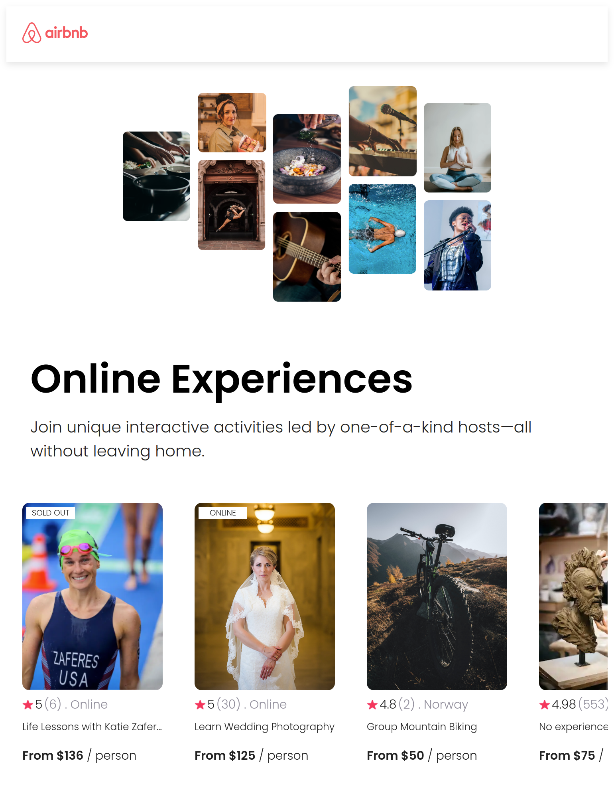

# airbnb-clone

This project made for learning props in component:  why we should use it?  How it's work?   How can I use it in my component?  & ...

### The challenge
The most challenging things was to understand the instruction of props, they way I can use to pass this data to my component, the method I should use ( map() ) to render separate component and pass data to this components.

### Screenshot

## My process

### Built with

- HTML5
- CSS custom properties
- Flexbox
- [React](https://reactjs.org/) - JS library

### Continued development

I will add this section ...

### Useful resources

- [YouTube](https://www.youtube.com) 
- [w3schools](https://www.w3schools.com)

## Author

- mr-dargi